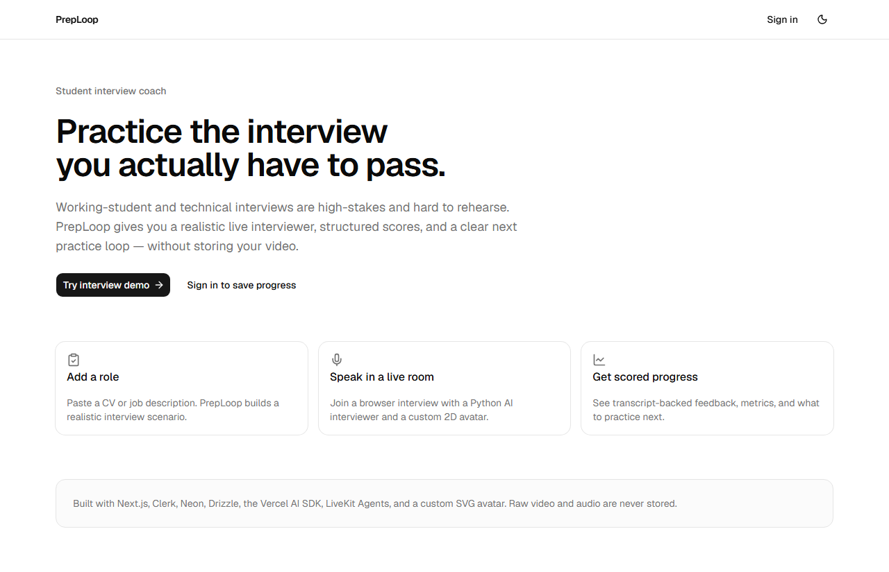
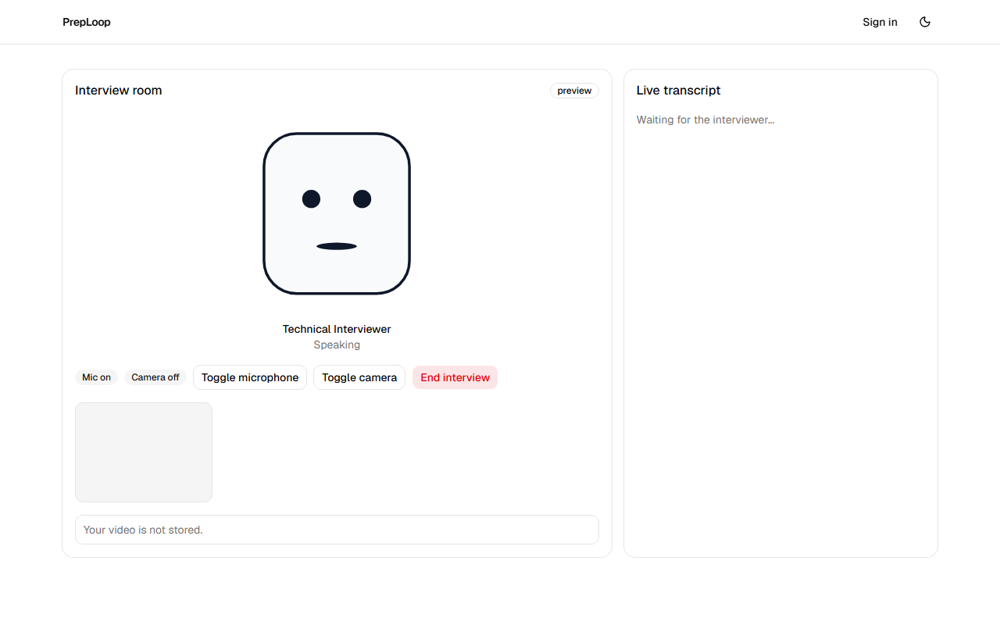
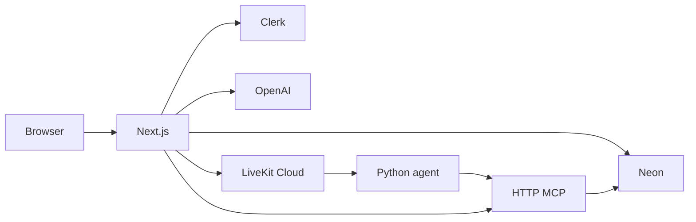
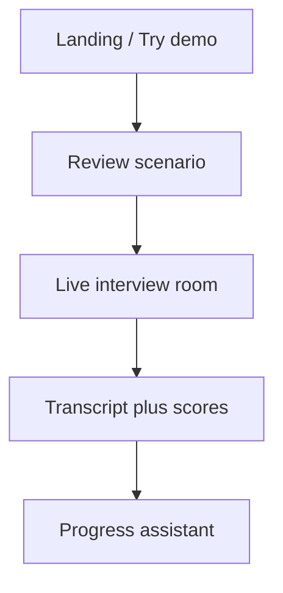

# PrepLoop

Student-focused interview coach for working-student and technical interviews. Paste a CV or job description, generate a realistic scenario, speak with a Python LiveKit interviewer and a custom 2D avatar, then review transcript-backed scores and progress.

The first seeded scenario targets the **Retorio Working Student AI Product Engineering – Data** role. Signed-in users can create their own practice packs.





## Architecture





- Next.js owns all persistence. The Python agent never talks to Postgres.
- `/api/mcp` exposes the same tools the analytics assistant uses in-process.
- Internal routes (`AGENT_INTERNAL_TOKEN`) persist turns and finalize a session exactly once.
- Raw PDFs are discarded after text extraction. Raw video/audio is never stored.

## Stack

- Next.js App Router, TypeScript, Node 22+, pnpm
- shadcn/ui (Nova/neutral, Lucide), Tailwind CSS
- Clerk auth + ephemeral guest cookie for one demo
- Neon + Drizzle ORM
- Vercel AI SDK + OpenAI
- LiveKit Agents (Python 3.12) + custom SVG avatar

## Setup

```bash
pnpm install
cp .env.example .env.local
```

Fill in Clerk, Neon, OpenAI, and LiveKit values. Then:

```bash
pnpm db:migrate
pnpm db:seed
pnpm dev
```

Python worker (separate process):

```bash
cd agent
python -m venv .venv
.venv\Scripts\activate
pip install -e ".[dev]"
python -m preploop_agent.agent start
```

Set `APP_URL` and `AGENT_INTERNAL_TOKEN` to match the Next.js app. The worker name is `preploop-interviewer`.

Refresh screenshots after UI changes with `node scripts/capture-screenshots.mjs` while `pnpm dev` is running.

## Demo

1. Open `/` and click **Try interview demo**.
2. Review the seeded Retorio scenario and start.
3. Allow microphone access. Camera is optional and never stored.
4. End the interview to generate transcript, metrics, and feedback.
5. Sign in to save history, create packs from paste/PDF, and ask the progress assistant.

Without LiveKit credentials the room still renders in preview mode so you can exercise the UI. Without OpenAI, scenario/feedback generation uses deterministic fallbacks.

## Tests

```bash
pnpm test
pnpm test:e2e
cd agent && pytest
```

Browser CI does not depend on live audio. Use `/preview/room` to verify avatar state transitions. Manual smoke: start the Python worker, join a LiveKit room, confirm the avatar mouth moves while the agent speaks.

## Deploy

- Frontend: Vercel (`pnpm build`)
- Database: Neon production `DATABASE_URL` + `pnpm db:migrate`
- Worker: LiveKit Cloud (`agent/livekit.toml`, agent name `preploop-interviewer`)

## CV-ready summary

PrepLoop is an interview practice product that combines a Next.js app, a LiveKit voice agent, MCP tools, hybrid evaluation (deterministic metrics + LLM rubric), and a custom 2D avatar. It is scoped to individual students: no CRM, org admin, payments, or raw media storage.
